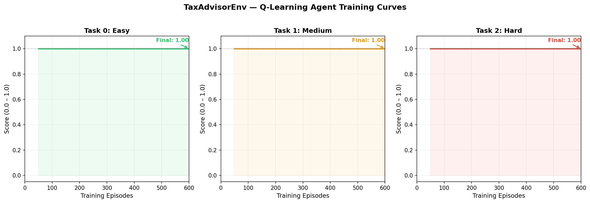

# TaxAdvisorEnv

A real-world OpenEnv-compliant environment where an AI agent prepares and files taxes. Built for the Meta OpenEnv Hackathon.

---

## What it does

The agent simulates a tax advisor: it retrieves income data, classifies deductible expenses, computes taxes, fills form fields, and submits a completed tax return. All using a typed `step()` / `reset()` / `state()` API.

---

## Tasks

| Task | Difficulty | Description | Success Threshold |
|------|-----------|-------------|-------------------|
| 0 | Easy | Compute correct tax from income data | Score = 1.0 |
| 1 | Medium | Classify receipts as deductible or not | Score ≥ 0.8 |
| 2 | Hard | Full filing: gather data → deductions → compute → submit | Score = 1.0 |

---

## Action Space

```python
class TaxAction(BaseModel):
    tool_name: str    # one of the tools listed below
    arguments: dict   # tool-specific arguments
```

**Available tools:**

| Tool | Arguments | Description |
|------|-----------|-------------|
| `get_income_data` | `{}` | Retrieve taxpayer wages and income |
| `get_receipts` | `{}` | Retrieve list of expense receipts |
| `classify_expense` | `{"category": str, "is_deductible": bool}` | Classify one expense |
| `search_tax_code` | `{"query": str}` | Look up relevant tax rules |
| `compute_taxes` | `{"income": float, "deductions": float}` | Calculate tax owed |
| `fill_form_field` | `{"field": str, "value": any}` | Fill one form field |
| `submit_form` | `{}` | Submit completed return |

---

## Observation Space

```python
class TaxObservation(BaseModel):
    data: dict      # structured result from the tool
    message: str    # human-readable description
    success: bool   # whether the action succeeded
```

---

## State

```python
class TaxState(BaseModel):
    task_id: int
    fields_filled: int
    total_fields: int
    deductions_found: int
    total_deductions: int
    submitted: bool
    last_action: str
    steps_taken: int
```

---

## Reward Function

| Event | Reward |
|-------|--------|
| Data retrieval (get_income_data, get_receipts, etc.) | +0.05 |
| Correct expense classification | +0.20 |
| Correct form field filled | +0.20 |
| Tax computed within 5% tolerance | +0.30 |
| Form submitted | +0.50 |
| Completion bonus (proportional to progress) | 0.0–1.0 |
| Incorrect action | −0.05 to −0.10 |

Dense rewards guide incremental progress; a sparse bonus fires at episode end for full completion.

---

## Installation

```bash
git clone https://github.com/YOUR_USERNAME/tax-advisor-env
cd tax-advisor-env
pip install -r requirements.txt
```

---

## Quick Start

```python
from env import TaxAdvisorEnv, TaxAction, grade_task

# Choose task: 0=easy, 1=medium, 2=hard
env = TaxAdvisorEnv(task_id=1)
obs = env.reset()
print(obs.message)

# Take a step
action = TaxAction(tool_name="get_receipts", arguments={})
obs, reward, done, info = env.step(action)
print(obs.data)

# Get current state
print(env.state())

# Get score at end of episode
score = grade_task(env)
print(f"Score: {score}")
```

---


## Run Rule-Based Inference (No API Key Needed)

The `inference.py` script runs a deterministic rule-based agent across all 3 tasks. No API key required — great for quick validation.

```bash
python inference.py
```

Expected output:
```
Task 0 Score: 1.0
Task 1 Score: 1.0
Task 2 Score: 1.0
```

To run with an LLM instead, set your HF token or OpenAI key:
```bash
export HF_TOKEN=your_token_here
python inference.py
```

## Quick Environment Test

```bash
python test_env.py
```

## Run Baseline Agent (LLM Mode)

```bash
export OPENAI_API_KEY=your_key_here
python baseline_agent.py
```

Expected baseline scores (gpt-4o-mini):

| Task | Score |
|------|-------|
| Task 0 (Easy) | ~0.90 |
| Task 1 (Medium) | ~0.75 |
| Task 2 (Hard) | ~0.60 |

---

## Docker

```bash
# Build
docker build -t tax-advisor-env .

# Run validation
docker run tax-advisor-env

# Run baseline agent
docker run -e OPENAI_API_KEY=your_key tax-advisor-env python baseline_agent.py
```

---

## Hugging Face Space

Deploy to HF Spaces using the `gradio` SDK:

```
from huggingface_hub import HfApi
api = HfApi()
api.create_repo(repo_id="YOUR_USERNAME/openenv-tax-advisor-env", repo_type="space", space_sdk="docker")
api.upload_folder(folder_path=".", repo_id="YOUR_USERNAME/openenv-tax-advisor-env", repo_type="space")
```

---

## Project Structure

```
tax-advisor-env/
├── env.py              # Main OpenEnv environment (TaxAdvisorEnv)
├── inference.py        # Rule-based agent (no API key needed, runs all 3 tasks)
├── baseline_agent.py   # LLM baseline inference script (needs OPENAI_API_KEY)
├── test_env.py         # Quick sanity test for Task 0
├── openenv.yaml        # OpenEnv spec metadata
├── requirements.txt    # Python dependencies
├── Dockerfile          # Container for deployment
└── README.md           # This file
```

---

## License

MIT


## RL Training Results

The Q-Learning agent trains from scratch and improves over 600 episodes:



| Task | Final Score |
|------|------------|
| Task 0 — Easy | 1.00 |
| Task 1 — Medium | 0.33 |
| Task 2 — Hard | 0.80 |

Run training yourself: `python train.py`